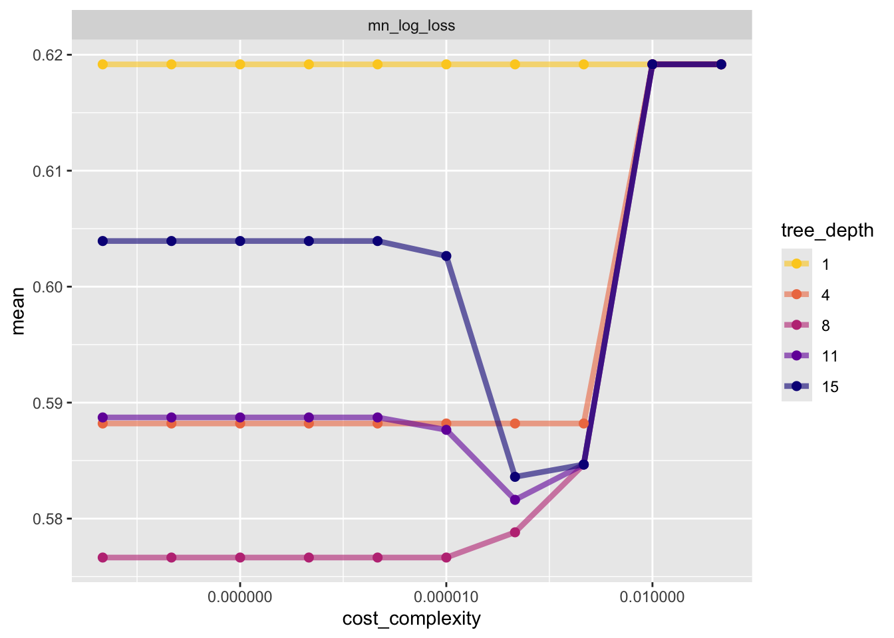

# Introduction

The data we will be looking at is from 70,692 survey responses to the CDC's Behavioral Risk Factor Surveillance System (BRFSS) 2015, which is a health-related telephone survey that is collected annually by the CDC. This data has an equal 50-50 split of respondents with no diabetes and with either prediabetes or diabetes.

Our goal is to create models for predicting the Diabetes variable. We’ll look at a few models and then select the best model.

# Split the Data

• We will use functions from tidymodels to split the data into a training and test set (70/30 split). • On the training set, we will create a 5 fold CV split.


::: {.cell}

```{.r .cell-code}
library(ranger)
library(tidymodels)
```

::: {.cell-output .cell-output-stderr}

```
── Attaching packages ────────────────────────────────────── tidymodels 1.4.1 ──
```


:::

::: {.cell-output .cell-output-stderr}

```
✔ broom        1.0.10     ✔ recipes      1.3.1 
✔ dials        1.4.2      ✔ rsample      1.3.1 
✔ dplyr        1.1.4      ✔ tailor       0.1.0 
✔ ggplot2      4.0.0      ✔ tidyr        1.3.1 
✔ infer        1.0.9      ✔ tune         2.0.1 
✔ modeldata    1.5.1      ✔ workflows    1.3.0 
✔ parsnip      1.3.3      ✔ workflowsets 1.1.1 
✔ purrr        1.1.0      ✔ yardstick    1.3.2 
```


:::

::: {.cell-output .cell-output-stderr}

```
── Conflicts ───────────────────────────────────────── tidymodels_conflicts() ──
✖ purrr::discard() masks scales::discard()
✖ dplyr::filter()  masks stats::filter()
✖ dplyr::lag()     masks stats::lag()
✖ recipes::step()  masks stats::step()
```


:::

```{.r .cell-code}
library(tidyverse)
```

::: {.cell-output .cell-output-stderr}

```
── Attaching core tidyverse packages ──────────────────────── tidyverse 2.0.0 ──
✔ forcats   1.0.0     ✔ stringr   1.5.2
✔ lubridate 1.9.4     ✔ tibble    3.2.1
✔ readr     2.1.5     
```


:::

::: {.cell-output .cell-output-stderr}

```
── Conflicts ────────────────────────────────────────── tidyverse_conflicts() ──
✖ readr::col_factor() masks scales::col_factor()
✖ purrr::discard()    masks scales::discard()
✖ dplyr::filter()     masks stats::filter()
✖ stringr::fixed()    masks recipes::fixed()
✖ dplyr::lag()        masks stats::lag()
✖ readr::spec()       masks yardstick::spec()
ℹ Use the conflicted package (<http://conflicted.r-lib.org/>) to force all conflicts to become errors
```


:::

```{.r .cell-code}
diabetes <- read_csv("diabetes_binary_5050split_health_indicators_BRFSS2015.csv")
```

::: {.cell-output .cell-output-stderr}

```
Rows: 70692 Columns: 22
── Column specification ────────────────────────────────────────────────────────
Delimiter: ","
dbl (22): Diabetes_binary, HighBP, HighChol, CholCheck, BMI, Smoker, Stroke,...

ℹ Use `spec()` to retrieve the full column specification for this data.
ℹ Specify the column types or set `show_col_types = FALSE` to quiet this message.
```


:::

```{.r .cell-code}
diabetes<-as.tibble(diabetes)
```

::: {.cell-output .cell-output-stderr}

```
Warning: `as.tibble()` was deprecated in tibble 2.0.0.
ℹ Please use `as_tibble()` instead.
ℹ The signature and semantics have changed, see `?as_tibble`.
```


:::

```{.r .cell-code}
str(diabetes)
```

::: {.cell-output .cell-output-stdout}

```
tibble [70,692 × 22] (S3: tbl_df/tbl/data.frame)
 $ Diabetes_binary     : num [1:70692] 0 0 0 0 0 0 0 0 0 0 ...
 $ HighBP              : num [1:70692] 1 1 0 1 0 0 0 0 0 0 ...
 $ HighChol            : num [1:70692] 0 1 0 1 0 0 1 0 0 0 ...
 $ CholCheck           : num [1:70692] 1 1 1 1 1 1 1 1 1 1 ...
 $ BMI                 : num [1:70692] 26 26 26 28 29 18 26 31 32 27 ...
 $ Smoker              : num [1:70692] 0 1 0 1 1 0 1 1 0 1 ...
 $ Stroke              : num [1:70692] 0 1 0 0 0 0 0 0 0 0 ...
 $ HeartDiseaseorAttack: num [1:70692] 0 0 0 0 0 0 0 0 0 0 ...
 $ PhysActivity        : num [1:70692] 1 0 1 1 1 1 1 0 1 0 ...
 $ Fruits              : num [1:70692] 0 1 1 1 1 1 1 1 1 1 ...
 $ Veggies             : num [1:70692] 1 0 1 1 1 1 1 1 1 1 ...
 $ HvyAlcoholConsump   : num [1:70692] 0 0 0 0 0 0 1 0 0 0 ...
 $ AnyHealthcare       : num [1:70692] 1 1 1 1 1 0 1 1 1 1 ...
 $ NoDocbcCost         : num [1:70692] 0 0 0 0 0 0 0 0 0 0 ...
 $ GenHlth             : num [1:70692] 3 3 1 3 2 2 1 4 3 3 ...
 $ MentHlth            : num [1:70692] 5 0 0 0 0 7 0 0 0 0 ...
 $ PhysHlth            : num [1:70692] 30 0 10 3 0 0 0 0 0 6 ...
 $ DiffWalk            : num [1:70692] 0 0 0 0 0 0 0 0 0 0 ...
 $ Sex                 : num [1:70692] 1 1 1 1 0 0 1 1 0 1 ...
 $ Age                 : num [1:70692] 4 12 13 11 8 1 13 6 3 6 ...
 $ Education           : num [1:70692] 6 6 6 6 5 4 5 4 6 4 ...
 $ Income              : num [1:70692] 8 8 8 8 8 7 6 3 8 4 ...
```


:::

```{.r .cell-code}
#selecting only the vatriables we want to look at as described in introduction
diabetes<-diabetes |>
  select(Diabetes_binary, HighBP, HighChol, BMI, PhysActivity, Fruits, Veggies, HvyAlcoholConsump, MentHlth, Sex)
str(diabetes)
```

::: {.cell-output .cell-output-stdout}

```
tibble [70,692 × 10] (S3: tbl_df/tbl/data.frame)
 $ Diabetes_binary  : num [1:70692] 0 0 0 0 0 0 0 0 0 0 ...
 $ HighBP           : num [1:70692] 1 1 0 1 0 0 0 0 0 0 ...
 $ HighChol         : num [1:70692] 0 1 0 1 0 0 1 0 0 0 ...
 $ BMI              : num [1:70692] 26 26 26 28 29 18 26 31 32 27 ...
 $ PhysActivity     : num [1:70692] 1 0 1 1 1 1 1 0 1 0 ...
 $ Fruits           : num [1:70692] 0 1 1 1 1 1 1 1 1 1 ...
 $ Veggies          : num [1:70692] 1 0 1 1 1 1 1 1 1 1 ...
 $ HvyAlcoholConsump: num [1:70692] 0 0 0 0 0 0 1 0 0 0 ...
 $ MentHlth         : num [1:70692] 5 0 0 0 0 7 0 0 0 0 ...
 $ Sex              : num [1:70692] 1 1 1 1 0 0 1 1 0 1 ...
```


:::

```{.r .cell-code}
#Check for how many NA variables we have

colSums(is.na(diabetes))
```

::: {.cell-output .cell-output-stdout}

```
  Diabetes_binary            HighBP          HighChol               BMI 
                0                 0                 0                 0 
     PhysActivity            Fruits           Veggies HvyAlcoholConsump 
                0                 0                 0                 0 
         MentHlth               Sex 
                0                 0 
```


:::

```{.r .cell-code}
#We have found that there are no missing values for the variables we selected, so that is not something we will have to worry about!

#Currently all of all variables are numeric, but it will make more sense to have several of them as factor variables. Next we will create factor versions of all variables except BMI and Mental Helath

diabetes <- diabetes |>
  mutate(
    DiabetesF = factor(
      Diabetes_binary,
      levels = c(0, 1),
      labels = c("No diabetes", "Prediabetes/Diabetes")
    ),
    BPF = factor(
      HighBP,
      levels = c(0, 1),
      labels = c("No high BP", "High BP")
    ),
    CholF = factor(
      HighChol,
      levels = c(0, 1),
      labels = c("No high cholesterol", "High cholesterol")
    ),
    PhysF = factor(
      PhysActivity,
      levels = c(0, 1),
      labels = c("No", "Yes")
    ),
    FruitsF = factor(
      Fruits,
      levels = c(0, 1),
      labels = c("No", "Yes")
    ),
    VeggiesF = factor(
      Veggies,
      levels = c(0, 1),
      labels = c("No", "Yes")
    ),
    AlcF = factor(
      HvyAlcoholConsump,
      levels = c(0, 1),
      labels = c("No", "Yes")
    ),
    SexF = factor(
      Sex,
      levels = c(0, 1),
      labels = c("Female", "Male")
    )
  )

diabetes<-diabetes |>
  select(DiabetesF, BPF, CholF, PhysF, FruitsF, VeggiesF, AlcF, SexF, BMI, MentHlth)

str(diabetes)
```

::: {.cell-output .cell-output-stdout}

```
tibble [70,692 × 10] (S3: tbl_df/tbl/data.frame)
 $ DiabetesF: Factor w/ 2 levels "No diabetes",..: 1 1 1 1 1 1 1 1 1 1 ...
 $ BPF      : Factor w/ 2 levels "No high BP","High BP": 2 2 1 2 1 1 1 1 1 1 ...
 $ CholF    : Factor w/ 2 levels "No high cholesterol",..: 1 2 1 2 1 1 2 1 1 1 ...
 $ PhysF    : Factor w/ 2 levels "No","Yes": 2 1 2 2 2 2 2 1 2 1 ...
 $ FruitsF  : Factor w/ 2 levels "No","Yes": 1 2 2 2 2 2 2 2 2 2 ...
 $ VeggiesF : Factor w/ 2 levels "No","Yes": 2 1 2 2 2 2 2 2 2 2 ...
 $ AlcF     : Factor w/ 2 levels "No","Yes": 1 1 1 1 1 1 2 1 1 1 ...
 $ SexF     : Factor w/ 2 levels "Female","Male": 2 2 2 2 1 1 2 2 1 2 ...
 $ BMI      : num [1:70692] 26 26 26 28 29 18 26 31 32 27 ...
 $ MentHlth : num [1:70692] 5 0 0 0 0 7 0 0 0 0 ...
```


:::
:::


::: {.cell}

```{.r .cell-code}
set.seed(11)
diabetes_split <- initial_split(diabetes, prop = 0.70)
diabetes_train <- training(diabetes_split)
diabetes_test <- testing(diabetes_split)
diabetes_5_fold <- vfold_cv(diabetes_train, 5)
```
:::


# Classification Tree

Classification Trees are a type of tree based method for modeling. Tree based methods split up the predictor space into regions, and on each region a different prediction can be made. Classification trees are used when the goal is to predict grpup membership. This is usually done by using the most prevalent class in the region as the prediction.


::: {.cell}

```{.r .cell-code}
# Recipe
ctree_rec <- recipe(DiabetesF ~ BPF + CholF + PhysF + FruitsF + VeggiesF + AlcF + SexF + BMI + MentHlth,
                    data = diabetes_train)

# Model
ctree_mod <- decision_tree(tree_depth = tune(),
                           min_n = 20,
                           cost_complexity = tune()) |>
  set_engine("rpart") |>
  set_mode("classification")


# Workflow
ctree_wkf <- workflow() |>
  add_recipe(ctree_rec) |>
  add_model(ctree_mod)

# Tune using defaults first
temp <- ctree_wkf |> 
  tune_grid(resamples = diabetes_5_fold,
           metrics = metric_set(mn_log_loss))  # classification metrics
temp |> 
  collect_metrics()
```

::: {.cell-output .cell-output-stdout}

```
# A tibble: 10 × 8
   cost_complexity tree_depth .metric     .estimator  mean     n std_err .config
             <dbl>      <int> <chr>       <chr>      <dbl> <int>   <dbl> <chr>  
 1    0.0000000001          5 mn_log_loss binary     0.582     5 0.00140 pre0_m…
 2    0.000000001          11 mn_log_loss binary     0.589     5 0.00222 pre0_m…
 3    0.00000001            1 mn_log_loss binary     0.619     5 0.00120 pre0_m…
 4    0.0000001             7 mn_log_loss binary     0.575     5 0.00157 pre0_m…
 5    0.000001             13 mn_log_loss binary     0.599     5 0.00367 pre0_m…
 6    0.00001               2 mn_log_loss binary     0.619     5 0.00120 pre0_m…
 7    0.0001                8 mn_log_loss binary     0.579     5 0.00206 pre0_m…
 8    0.001                15 mn_log_loss binary     0.585     5 0.00129 pre0_m…
 9    0.01                  4 mn_log_loss binary     0.619     5 0.00120 pre0_m…
10    0.1                  10 mn_log_loss binary     0.619     5 0.00120 pre0_m…
```


:::

```{.r .cell-code}
# Define grid for tuning
tree_grid <- grid_regular(cost_complexity(),
                          tree_depth(),
                          levels = c(cost_complexity = 10, tree_depth = 5))

# Tune over grid
tree_fits <- ctree_wkf |> 
  tune_grid(resamples = diabetes_5_fold,
            grid = tree_grid,
            metrics = metric_set(mn_log_loss))
tree_fits
```

::: {.cell-output .cell-output-stdout}

```
# Tuning results
# 5-fold cross-validation 
# A tibble: 5 × 4
  splits               id    .metrics          .notes          
  <list>               <chr> <list>            <list>          
1 <split [39587/9897]> Fold1 <tibble [50 × 6]> <tibble [0 × 4]>
2 <split [39587/9897]> Fold2 <tibble [50 × 6]> <tibble [0 × 4]>
3 <split [39587/9897]> Fold3 <tibble [50 × 6]> <tibble [0 × 4]>
4 <split [39587/9897]> Fold4 <tibble [50 × 6]> <tibble [0 × 4]>
5 <split [39588/9896]> Fold5 <tibble [50 × 6]> <tibble [0 × 4]>
```


:::

```{.r .cell-code}
# Collect metrics
tree_fits |> 
  collect_metrics()
```

::: {.cell-output .cell-output-stdout}

```
# A tibble: 50 × 8
   cost_complexity tree_depth .metric     .estimator  mean     n std_err .config
             <dbl>      <int> <chr>       <chr>      <dbl> <int>   <dbl> <chr>  
 1    0.0000000001          1 mn_log_loss binary     0.619     5 0.00120 pre0_m…
 2    0.0000000001          4 mn_log_loss binary     0.588     5 0.00159 pre0_m…
 3    0.0000000001          8 mn_log_loss binary     0.577     5 0.00179 pre0_m…
 4    0.0000000001         11 mn_log_loss binary     0.589     5 0.00222 pre0_m…
 5    0.0000000001         15 mn_log_loss binary     0.604     5 0.00451 pre0_m…
 6    0.000000001           1 mn_log_loss binary     0.619     5 0.00120 pre0_m…
 7    0.000000001           4 mn_log_loss binary     0.588     5 0.00159 pre0_m…
 8    0.000000001           8 mn_log_loss binary     0.577     5 0.00179 pre0_m…
 9    0.000000001          11 mn_log_loss binary     0.589     5 0.00222 pre0_m…
10    0.000000001          15 mn_log_loss binary     0.604     5 0.00451 pre0_m…
# ℹ 40 more rows
```


:::

```{.r .cell-code}
# Plot metrics vs parameters
tree_fits |> 
  collect_metrics() |>
  mutate(tree_depth = factor(tree_depth)) |>
  ggplot(aes(cost_complexity, mean, color = tree_depth)) +
  geom_line(size = 1.5, alpha = 0.6) +
  geom_point(size = 2) +
  facet_wrap(~ .metric, scales = "free", nrow = 2) +
  scale_x_log10(labels = scales::label_number()) +
  scale_color_viridis_d(option = "plasma", begin = .9, end = 0)
```

::: {.cell-output .cell-output-stderr}

```
Warning: Using `size` aesthetic for lines was deprecated in ggplot2 3.4.0.
ℹ Please use `linewidth` instead.
```


:::

::: {.cell-output-display}
{width=672}
:::

```{.r .cell-code}
tree_fits |>
  collect_metrics() |>
  mutate(tree_depth = factor(tree_depth)) |>
  ggplot(aes(cost_complexity, mean, color = tree_depth)) +
  geom_line(size = 1.5, alpha = 0.6) +
  geom_point(size = 2) +
  facet_wrap(~ .metric, scales = "free", nrow = 2) +
  scale_x_log10(labels = scales::label_number()) +
  scale_color_viridis_d(option = "plasma", begin = .9, end = 0)
```

::: {.cell-output-display}
{width=672}
:::

```{.r .cell-code}
# Arrange results by accuracy
tree_fits |> 
  collect_metrics() |>
  filter(.metric == "accuracy") |>
  arrange(desc(mean))
```

::: {.cell-output .cell-output-stdout}

```
# A tibble: 0 × 8
# ℹ 8 variables: cost_complexity <dbl>, tree_depth <int>, .metric <chr>,
#   .estimator <chr>, mean <dbl>, n <int>, std_err <dbl>, .config <chr>
```


:::

```{.r .cell-code}
# Select best parameters
tree_best_params <- select_best(tree_fits, metric = "mn_log_loss")
tree_best_params
```

::: {.cell-output .cell-output-stdout}

```
# A tibble: 1 × 3
  cost_complexity tree_depth .config         
            <dbl>      <int> <chr>           
1    0.0000000001          8 pre0_mod03_post0
```


:::

```{.r .cell-code}
#Refit on the entire training set using this tuning parameter

ctree_final_wkf <- ctree_wkf |> finalize_workflow(tree_best_params)

ctree_final_fit <- ctree_final_wkf |>
  last_fit(diabetes_split, metrics = metric_set(accuracy, mn_log_loss))

collect_metrics(ctree_final_fit)
```

::: {.cell-output .cell-output-stdout}

```
# A tibble: 2 × 4
  .metric     .estimator .estimate .config        
  <chr>       <chr>          <dbl> <chr>          
1 accuracy    binary         0.712 pre0_mod0_post0
2 mn_log_loss binary         0.568 pre0_mod0_post0
```


:::
:::


# Random Forest Model

For a random forest model we will create multiple trees from bootstrap samples and average the results in some way for the final prediction. Random forests do not use all predictors at each step, and considers splits using a random subset of predictors each time, where the number is a tuning parameter. Using a radom forest model makes bagged trees predictions more correlated. By randomly selecting a subset of predictors, a good predictor or two won't dominate the tree fits!


::: {.cell}

```{.r .cell-code}
# Recipe
RF_rec <- recipe(DiabetesF ~ BPF + CholF + PhysF + FruitsF + VeggiesF + AlcF + SexF + BMI + MentHlth,
                    data = diabetes_train) |>
  step_normalize(all_numeric()) |>
 step_dummy(BPF, CholF, PhysF, FruitsF, VeggiesF, AlcF, SexF)
RF_rec |>
prep(diabetes_train) |>
 bake(diabetes_train) 
```

::: {.cell-output .cell-output-stdout}

```
# A tibble: 49,484 × 10
      BMI MentHlth DiabetesF        BPF_High.BP CholF_High.cholesterol PhysF_Yes
    <dbl>    <dbl> <fct>                  <dbl>                  <dbl>     <dbl>
 1  0.589   -0.458 Prediabetes/Dia…           1                      1         0
 2 -1.53    -0.458 Prediabetes/Dia…           0                      1         1
 3 -0.683   -0.458 No diabetes                1                      1         1
 4 -0.824   -0.458 No diabetes                1                      0         1
 5 -0.400   -0.458 Prediabetes/Dia…           0                      1         1
 6 -0.824    2.01  No diabetes                0                      1         1
 7 -0.400   -0.458 No diabetes                1                      1         0
 8  0.447   -0.458 Prediabetes/Dia…           0                      0         1
 9 -0.541   -0.458 No diabetes                0                      0         1
10 -0.824    1.51  No diabetes                1                      0         1
# ℹ 49,474 more rows
# ℹ 4 more variables: FruitsF_Yes <dbl>, VeggiesF_Yes <dbl>, AlcF_Yes <dbl>,
#   SexF_Male <dbl>
```


:::

```{.r .cell-code}
#Model

rf_mod <- rand_forest(mtry= tune()) |>
  set_engine("ranger") |>
  set_mode("classification")

#workflow

rf_wkf <- workflow() |>
 add_recipe(RF_rec) |>
 add_model(rf_mod)

#fit to our CV folds

rf_fit <- rf_wkf |>
 tune_grid(resamples = diabetes_5_fold,
 grid = grid_regular(mtry(range = c(2, 9)), levels = 7),
 metrics = metric_set(accuracy, mn_log_loss))

#Check our metrics across the folds

rf_fit |>
 collect_metrics() |>
 filter(.metric == "mn_log_loss") |>
 arrange(mean)
```

::: {.cell-output .cell-output-stdout}

```
# A tibble: 7 × 7
   mtry .metric     .estimator  mean     n  std_err .config        
  <int> <chr>       <chr>      <dbl> <int>    <dbl> <chr>          
1     3 mn_log_loss binary     0.566     5 0.000484 pre0_mod2_post0
2     2 mn_log_loss binary     0.568     5 0.000482 pre0_mod1_post0
3     4 mn_log_loss binary     0.573     5 0.000511 pre0_mod3_post0
4     5 mn_log_loss binary     0.582     5 0.000706 pre0_mod4_post0
5     6 mn_log_loss binary     0.592     5 0.000780 pre0_mod5_post0
6     7 mn_log_loss binary     0.600     5 0.000844 pre0_mod6_post0
7     9 mn_log_loss binary     0.627     5 0.00506  pre0_mod7_post0
```


:::

```{.r .cell-code}
# Get our best tuning parameter

rf_best_params <- select_best(rf_fit, metric = "mn_log_loss")
rf_best_params
```

::: {.cell-output .cell-output-stdout}

```
# A tibble: 1 × 2
   mtry .config        
  <int> <chr>          
1     3 pre0_mod2_post0
```


:::

```{.r .cell-code}
#Refit on the entire training set using this tuning parameter

rf_final_wkf <- rf_wkf |>
 finalize_workflow(rf_best_params)
rf_final_fit <- rf_final_wkf |>
 last_fit(diabetes_split, metrics = metric_set(accuracy, mn_log_loss))

collect_metrics(rf_final_fit)
```

::: {.cell-output .cell-output-stdout}

```
# A tibble: 2 × 4
  .metric     .estimator .estimate .config        
  <chr>       <chr>          <dbl> <chr>          
1 accuracy    binary         0.713 pre0_mod0_post0
2 mn_log_loss binary         0.562 pre0_mod0_post0
```


:::
:::


# Compare!!

Now that we have both done, lets compare and choose our winner! That winning model we will then fit on the entire data set.


::: {.cell}

```{.r .cell-code}
collect_metrics(ctree_final_fit)
```

::: {.cell-output .cell-output-stdout}

```
# A tibble: 2 × 4
  .metric     .estimator .estimate .config        
  <chr>       <chr>          <dbl> <chr>          
1 accuracy    binary         0.712 pre0_mod0_post0
2 mn_log_loss binary         0.568 pre0_mod0_post0
```


:::

```{.r .cell-code}
collect_metrics(rf_final_fit)
```

::: {.cell-output .cell-output-stdout}

```
# A tibble: 2 × 4
  .metric     .estimator .estimate .config        
  <chr>       <chr>          <dbl> <chr>          
1 accuracy    binary         0.713 pre0_mod0_post0
2 mn_log_loss binary         0.562 pre0_mod0_post0
```


:::
:::


We want the smallest log loss as our final winner. The log loss is smaller for the random forest model so that is what we will use! Now we will fit that to the entire data set.

# Fitting to Full Data Set


::: {.cell}

```{.r .cell-code}
rf_final_model <- rf_final_wkf |>
  fit(diabetes)

#save so I can use in API
saveRDS(rf_final_model, "rf_final_model.rds")
```
:::


